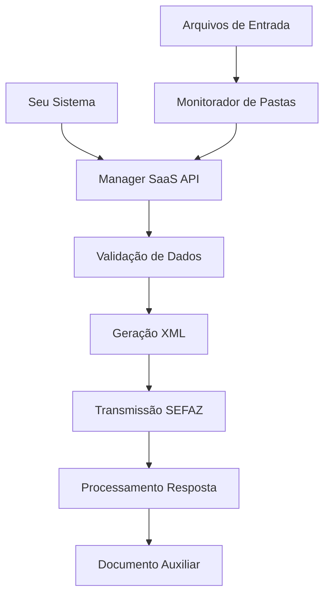

# Visão Geral do Manager SaaS

## O que é o Manager SaaS?

O **Manager SaaS** é uma solução completa em nuvem que gerencia e executa todos os processos de emissão de documentos fiscais eletrônicos no Brasil. É uma API robusta que automatiza todo o fluxo fiscal, desde a validação dos dados até a geração dos documentos finais.

## Arquitetura da Solução

## Componentes Principais

### 1. **API REST**
- Endpoints HTTPS para todas as operações
- Autenticação via token de acesso
- Respostas em JSON
- Webhooks para notificações

### 2. **Monitorador de Pastas**
- Sistema de monitoramento de diretórios
- Processamento automático de arquivos
- Suporte a múltiplos formatos
- Ideal para integrações batch

### 3. **Processador Fiscal**
- Validação automática de dados
- Geração de XML conforme SEFAZ
- Tratamento de erros e validações
- Logs detalhados de todas as operações

## Fluxo de Trabalho

### **Emissão de Documentos**

1. **Envio de Dados**
   - Via API REST ou arquivo de texto
   - Validação automática dos parâmetros
   - Confirmação de recebimento

2. **Processamento**
   - Geração do XML conforme especificações
   - Validações fiscais e legais
   - Preparação para transmissão

3. **Transmissão SEFAZ**
   - Envio para a SEFAZ correspondente
   - Aguardando processamento
   - Recebimento da resposta

4. **Finalização**
   - Processamento da resposta da SEFAZ
   - Geração do documento auxiliar
   - Notificação de conclusão

### **Monitoramento e Consultas**

- Status em tempo real dos documentos
- Consulta de documentos emitidos
- Download de arquivos XML e PDF
- Histórico completo de operações

## Vantagens da Solução

<CardGroup cols={2}>
  <Card
    title="Automação Completa"
    icon="robot"
  >
    Elimina a necessidade de implementar sistemas fiscais complexos
  </Card>
  <Card
    title="Conformidade Legal"
    icon="shield-check"
  >
    Sempre atualizado com as últimas legislações
  </Card>
  <Card
    title="Escalabilidade"
    icon="trending-up"
  >
    Suporta desde pequenas empresas até grandes corporações
  </Card>
  <Card
    title="Integração Simples"
    icon="plug"
  >
    API REST padrão e documentação completa
  </Card>
</CardGroup>

## Casos de Uso

### **E-commerce**
- Emissão automática de NF-e para vendas online
- Integração com sistemas de pagamento
- Geração de documentos em tempo real

### **ERP e Sistemas de Gestão**
- Emissão em lote de documentos fiscais
- Sincronização com cadastros de clientes
- Controle de estoque e faturamento

### **Sistemas POS**
- Emissão de NFC-e para vendas presenciais
- Integração com impressoras térmicas
- Controle de caixa e vendas

### **Transportadoras**
- Emissão de CT-e para operações de transporte
- Manifesto eletrônico (MDF-e)
- Controle de fretes e cargas

## Segurança e Conformidade

- **Criptografia**: Todas as comunicações são criptografadas
- **Autenticação**: Sistema robusto de autenticação e autorização
- **Auditoria**: Logs completos de todas as operações
- **Backup**: Redundância e backup automático de dados
- **Conformidade**: Atende aos padrões da SEFAZ e LGPD

## Próximos Passos

Agora que você entende os conceitos básicos, explore:

- [Tipos de Documentos](/concepts/document-types) - Conheça todos os documentos suportados
- [Métodos de Comunicação](/concepts/communication-methods) - API REST vs Monitorador de Pastas
- [Primeiros Passos](/quickstart) - Configure sua primeira integração
- [Referência da API](/api/endpoints/emission) - Explore todos os endpoints disponíveis 