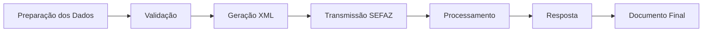

# CT-e - Conhecimento de Transporte Eletrônico

## O que é CT-e?

O **CT-e** (Conhecimento de Transporte Eletrônico) é um documento fiscal eletrônico que substitui o conhecimento de transporte tradicional, documentando a prestação de serviços de transporte de cargas e mercadorias.

## Tipos de CT-e

### **CT-e Normal**
- Para transportes de cargas entre diferentes estabelecimentos
- Documenta o transporte de mercadorias
- Inclui informações sobre origem, destino e carga

### **CT-e OS (Outros Serviços)**
- Para prestação de serviços de transporte diversos
- Documenta serviços como armazenagem, logística
- Não necessariamente transporte de cargas

### **CT-e Complementar**
- Para complementar informações de CT-e já emitido
- Adiciona dados que não foram incluídos no original

### **CT-e Substituição**
- Para substituir CT-e anterior
- Em caso de correções ou alterações necessárias

## Estrutura do CT-e

### **Cabeçalho**
- Dados do emitente (transportadora)
- Dados do tomador (contratante)
- Informações do documento
- Dados fiscais

### **Dados de Transporte**
- Origem e destino
- Tipo de veículo
- Dados do motorista
- Rota de transporte

### **Carga**
- Descrição das mercadorias
- Peso e volume
- Valor da carga
- Impostos incidentes

### **Serviços**
- Valor do frete
- Despesas acessórias
- Seguro de transporte
- Condições de pagamento

## Fluxo de Emissão



## Vantagens do CT-e

<CardGroup cols={2}>
  <Card
    title="Validade Jurídica"
    icon="shield-check"
  >
    Documento com validade legal e fiscal
  </Card>
  <Card
    title="Controle Fiscal"
    icon="chart-line"
  >
    Melhor controle e fiscalização
  </Card>
  <Card
    title="Automação"
    icon="robot"
  >
    Processo automatizado e eficiente
  </Card>
  <Card
    title="Integração"
    icon="plug"
  >
    Integração com sistemas de gestão
  </Card>
</CardGroup>

## Obrigatoriedade

### **Quem deve emitir**
- Transportadoras
- Empresas de logística
- Prestadores de serviços de transporte
- Empresas que realizam transporte próprio

### **Quando emitir**
- Transporte de cargas entre estabelecimentos
- Prestação de serviços de transporte
- Movimentação de mercadorias
- Serviços logísticos

## Integração com Manager SaaS

### **API REST**
- Endpoints específicos para cada tipo de CT-e
- Validação automática de dados
- Respostas em tempo real
- Webhooks para notificações

### **Monitorador de Pastas**
- Processamento em lote
- Arquivos de texto estruturados
- Processamento automático
- Logs detalhados

### **Funcionalidades**
- Emissão automática
- Validação de dados
- Geração de XML
- Transmissão para SEFAZ
- Geração de PDF
- Consulta de status

## Campos Obrigatórios

### **Dados do Emitente**
- CNPJ/CPF
- Inscrição estadual
- Razão social
- Endereço completo

### **Dados do Tomador**
- CNPJ/CPF
- Inscrição estadual
- Razão social
- Endereço de entrega

### **Dados do Serviço**
- Descrição do serviço
- Valor do frete
- Data de prestação
- Local de prestação

### **Dados de Transporte**
- Origem
- Destino
- Tipo de veículo
- Dados do motorista

## Validações Importantes

### **Validações de Negócio**
- CNPJ/CPF válidos
- Inscrições estaduais ativas
- Endereços válidos
- Valores positivos
- Datas válidas

### **Validações Fiscais**
- Conformidade com legislação
- Cálculos corretos de impostos
- Validações específicas da SEFAZ
- Regras de negócio aplicáveis

## Status do Documento

### **Fluxo de Status**
1. **PENDENTE**: Documento recebido
2. **PROCESSANDO**: Em processamento
3. **AUTORIZADO**: Documento aprovado
4. **REJEITADO**: Documento rejeitado
5. **CANCELADO**: Documento cancelado

### **Consultas**
- Status em tempo real
- Histórico de alterações
- Logs de processamento
- Arquivos XML e PDF

## Cancelamento

### **Condições**
- Documento autorizado
- Prazo máximo de 24 horas
- Justificativa obrigatória
- Validações específicas

### **Processo**
- Solicitação via API
- Validação de condições
- Processamento na SEFAZ
- Confirmação de cancelamento

## Arquivos Disponíveis

### **Tipos de Arquivo**
- **XML**: Arquivo original da SEFAZ
- **PDF**: Documento auxiliar
- **Log**: Log de processamento
- **JSON**: Dados estruturados

### **Download**
- Via API REST
- Via monitorador de pastas
- URLs diretas para download
- Arquivos temporários

## Exemplos de Uso

### **Transporte de Cargas**
```json
{
  "tipo_documento": "CTE_NORMAL",
  "origem": "São Paulo, SP",
  "destino": "Rio de Janeiro, RJ",
  "carga": "Eletrônicos diversos",
  "valor_frete": 500.00
}
```

### **Serviço de Armazenagem**
```json
{
  "tipo_documento": "CTE_OS",
  "servico": "Armazenagem de mercadorias",
  "valor_servico": 300.00
}
```

## Próximos Passos

- [CT-e OS - Emissão](/documents/cte/os-emission) - Aprenda sobre CT-e OS
- [Emissão de CT-e](/documents/cte/emission) - Como emitir CT-e
- [Referência da API](/api/endpoints/emission) - Endpoints disponíveis
- [Exemplos de Integração](/examples/php) - Casos práticos

---

*Para mais informações sobre CT-e, consulte nossa documentação completa ou entre em contato: suporte@managersaas.com* 